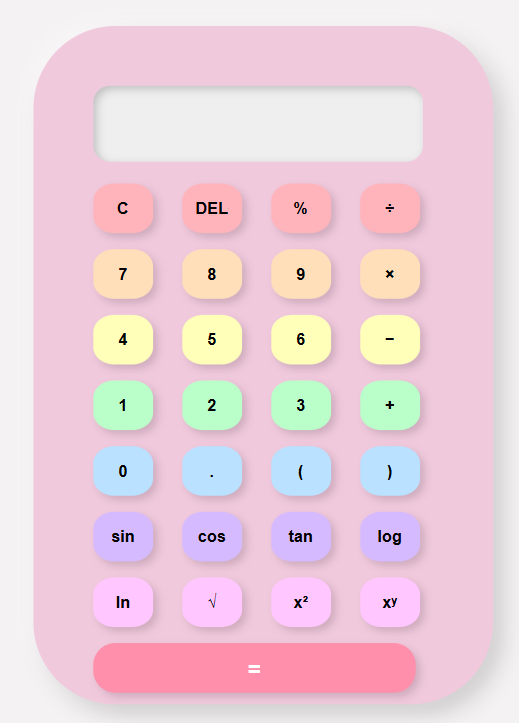

# Advanced Scientific Calculator

A responsive and visually appealing scientific calculator built using **HTML**, **CSS**, and **JavaScript**. The calculator supports basic arithmetic operations, scientific functions, keyboard input, memory operations, and a modern pastel-themed user interface.

## 🚀 Features

### Basic Operations

* Addition (+)
* Subtraction (−)
* Multiplication (×)
* Division (÷)
* Percentage (%)
* Parentheses support `()` for complex expressions

### Scientific Functions

* Sine (`sin`)
* Cosine (`cos`)
* Tangent (`tan`)
* Logarithm Base 10 (`log`)
* Natural Logarithm (`ln`)
* Square Root (`√`)
* Power Functions (`x²`, `xʸ`)

### Utility Functions

* Clear Display (`C`)
* Delete Last Character (`DEL`)
* Error Handling for Invalid Expressions

### Memory Operations

* Memory Clear (MC)
* Memory Recall (MR)
* Memory Add (M+)
* Memory Subtract (M−)

### Keyboard Support

Use your keyboard for faster calculations:

* Numbers (0–9)
* Arithmetic Operators (+, -, *, /, %)
* Parentheses
* Enter Key (=)
* Backspace (Delete Last Character)

### Responsive Design

* Mobile-friendly layout
* Smooth button animations
* Soft pastel color palette
* Modern neumorphic-inspired UI

---

## 🛠️ Technologies Used

* HTML5
* CSS3
* JavaScript (Vanilla JS)

---

## 📂 Project Structure

```text
MINI PROJECT/
├── README.md
├── calculator-screenshot.png
├── calculator.html
├── calculator.css
└── calculator.js
```

---

## ▶️ How to Run

1. Open the project folder.

2. Launch `index.html` in your browser.

No additional dependencies or installations are required.

---

## 📸 Screenshots



## ⚙️ Future Improvements

* Dark Mode
* Calculation History
* Theme Customization
* Scientific Constants (π, e)
* Advanced Mathematical Functions
* Improved Expression Parser (without using `eval()`)

---

## 🔒 Note

This project currently uses JavaScript's `eval()` function to evaluate expressions. While suitable for learning purposes, a custom parser is recommended for production-level applications.

---

## 👩‍💻 Author

Developed as a frontend web development project using HTML, CSS, and JavaScript.
